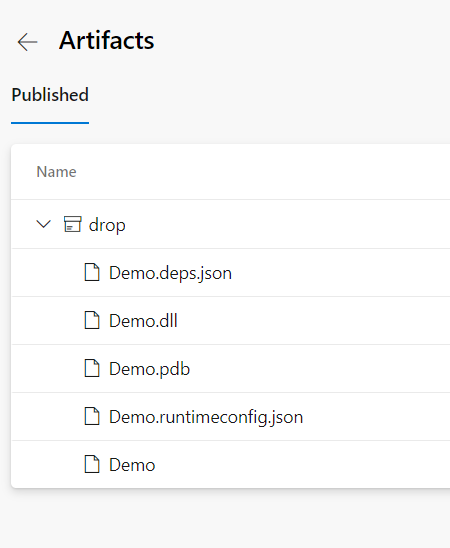
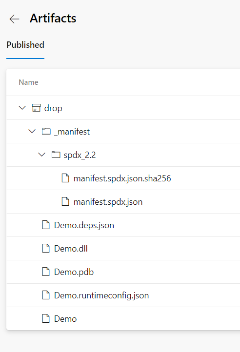

# Adding SBOM generation to an Azure DevOps Pipeline

This document provides a sample case for integrating the SBOM tool into Azure DevOps Pipelines.  User may use this guide for adding the tool to an Azure DevOps Pipeline.

## Existing setup

In this sample Azure DevOps project, the source contains a project called Demo.  There is also a Build pipeline that builds the project then saves the generated binaries as a pipeline artifact.

```yaml
pool:
  vmImage: ubuntu-latest

steps:
- task: UseDotNet@2
  inputs:
    packageType: 'sdk'
    version: '6.x'

- script: |
    dotnet build $(Build.SourcesDirectory)/Demo.csproj --output $(Build.ArtifactStagingDirectory)
  displayName: 'Build the project'

- task: PublishBuildArtifacts@1
  inputs:
    PathtoPublish: '$(Build.ArtifactStagingDirectory)'
    ArtifactName: 'drop'
    publishLocation: 'Container'
```

In this pipeline, the user first builds the dotnet project.  The generated binaries are stored in the artifacts staging directory. In the final step, upload these artifacts to the pipline artifacts. Any dependent pipeline or release can now consume these binaries using this pipeline artifact.  Check the build pipeline artifacts in the project in order to see the commplete set of binaries generated for the Demo project.



## Adding the SBOM generation task

Now the user can generate the SBOM for the pipeline artifacts which the previous step produced. Ths process will store the generated SBOM as part of the pipeline artifacts so that the user can distribute the artifact to the desired downstream dependencies. 

```yaml
pool:
  vmImage: ubuntu-latest

steps:
- task: UseDotNet@2
  inputs:
    packageType: 'sdk'
    version: '6.x'

- script: |
    dotnet build $(Build.SourcesDirectory)/Demo.csproj --output $(Build.ArtifactStagingDirectory)
  displayName: 'Build the project'

- script: |
    curl -Lo $(Agent.TempDirectory)/sbom-tool https://github.com/microsoft/sbom-tool/releases/latest/download/sbom-tool-linux-x64
    chmod +x $(Agent.TempDirectory)/sbom-tool
    $(Agent.TempDirectory)/sbom-tool generate -b $(Build.ArtifactStagingDirectory) -bc $(Build.SourcesDirectory) -pn Test -pv 1.0.0 -ps MyCompany -nsb https://sbom.mycompany.com -V Verbose
  displayName: Generate SBOM

- task: PublishBuildArtifacts@1
  inputs:
    PathtoPublish: '$(Build.ArtifactStagingDirectory)'
    ArtifactName: 'drop'
    publishLocation: 'Container'
```

This process added the SBOM generation task after the build ran and produced artifacts in the `$(Build.ArtifactStagingDirectory)` directory.  Since the `$(Build.SourcesDirectory)` folder contains the `Demo.csproj` file that contains the dependencies for our project, the user passes the parameter to the build components path. The package name, version and namespace base URI are static strings for the tool. Set the verbosity to `Verbose` at this point in time so tht the user can see additional output while testing the SBOM generation.

Since the sbom tool will place the generated SBOM file into the build drop folder (`$(Build.ArtifactStagingDirectory)` folder in this case), this original artifact upload task now also uploads the SBOM to the Actions artifacts as seen below.



The preceding steps will provide the SBOM file with the same retention as the pipeline artifacts for the Azure DevOps pipeline.

## Further reading

Teams using a central repository to store SBOM file can use the `-manifestDirPath` parameter for specifying the location of the central repository.  Users will need to ensure that they have write permissions enabled on the target repository location.