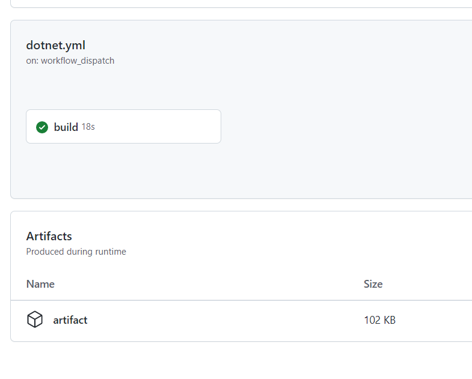
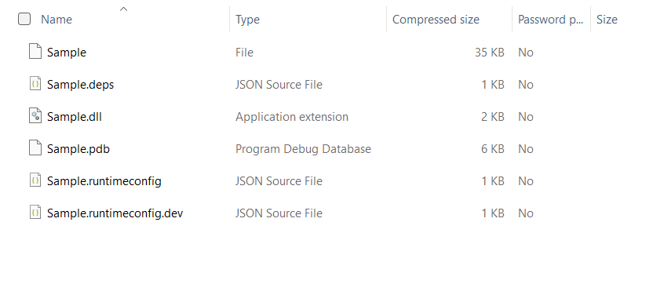
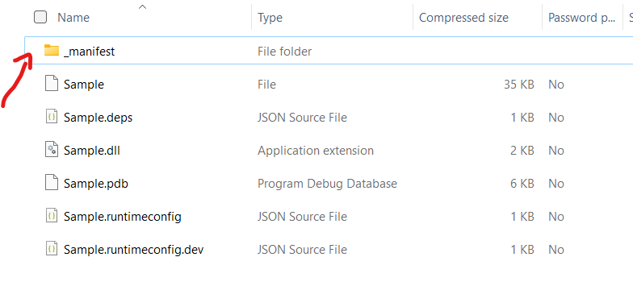

# Setting up SBOM generation for GitHub Actions

Users may use the sample code provided below for integrating the SBOM tool into GitHub Actions.

## Existing setup

In this Github project, the source contains a project called 'Sample'.  The workflow builds the project and saves the generated binaries as pipeline artifacts.

```yaml
name: Sample

on: 
  workflow_dispatch:

jobs:
  build:

    runs-on: ubuntu-latest

    steps:
    - uses: actions/checkout@v3
    - name: Setup .NET
      uses: actions/setup-dotnet@v2
      with:
        dotnet-version: 6.0.x

    - name: Build
      run: dotnet build Sample.sln --output buildOutput

    - name: Upload a Build Artifact
      uses: actions/upload-artifact@v3.1.0
      with:
        path: buildOutput
```

Once the sbom tool produces SBOM, the user can see that the Actions run page now contains the newly generated binares and other file artifacts.




## Adding the SBOM generation task

The user will now produce the SBOM file for the build artifacts generated during the previous step. The ideal end state is the storage of the final product - the newly-generated SBOM file - as part of the build artifacts for future artifact distribution to the downstream dependencies. 

```yaml
name: Sample with SBOM generation

on: 
  workflow_dispatch:

jobs:
  build:

    runs-on: ubuntu-latest

    steps:
    - uses: actions/checkout@v3
    - name: Setup .NET
      uses: actions/setup-dotnet@v2
      with:
        dotnet-version: 6.0.x
    - name: Build
      run: dotnet build Sample.sln --output buildOutput
      
    - name: Generate SBOM
      run: |
        curl -Lo $RUNNER_TEMP/sbom-tool https://github.com/microsoft/sbom-tool/releases/latest/download/sbom-tool-linux-x64
        chmod +x $RUNNER_TEMP/sbom-tool
        $RUNNER_TEMP/sbom-tool generate -b ./buildOutput -bc . -pn Test -pv 1.0.0 -ps MyCompany -nsb https://sbom.mycompany.com -V Verbose

    - name: Upload a Build Artifact
      uses: actions/upload-artifact@v3.1.0
      with:
        path: buildOutput
```

The SBOM generation task occured after the build ran, thus producing artifacts in the `buildOutput` folder.  Since the source folder contains the `Sample.csproj` file that holds the project's dependencies items, the build components path is an important parameter. The package name, version and namespace base URI are static string in the sbomtool.  The verbosity paramater is set to `Verbose` at this point in order to provide the desired output during the SBOM generation test runs.

Since the sbom tool will place the final SBOM file in the build drop folder (buildOutput folder in this scenario), the original artifact upload task now also uploads the SBOM to the Actions artifacts as seen below.



This line of code produces a SBOM file with the same information as the GitHub Action.

## The above steps give the SBOM the same retention as the build artifacts for the GitHub Action."

## Further reading

If the organization or team stores the SBOM in a centrally-controlled repository, use the `-manifestDirPath` parameter to specify the intended folder location for the SBOM output file.